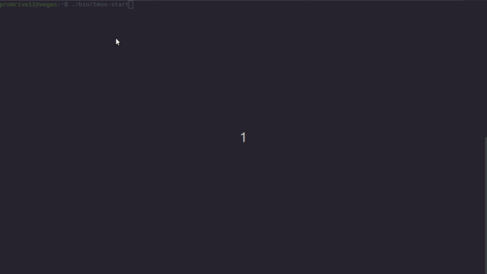

Heard of **Oh My Zsh**?  
Well this is my take on more **productivity** focused `bash` terminal settings. A lot more compact and useful, but without to much hustle.  

## Dependencies  
 - bash
 - tmux 2.6
 - rlwrap
 - ctags
 - git
 - vim

## Using dotz

 1. `git clone` in place, or copy all files to `$HOME/`
 2. $HOME/bin/tmux-start
 3. source $HOME/.dotz/dot

> or place `2` and/or `3` in ~/.bashrc
  
